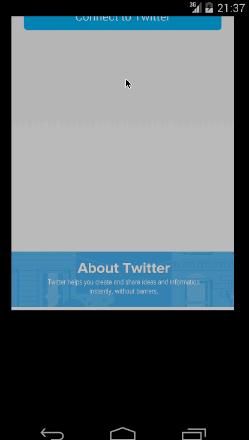

#TheTweetZone

**Extend our Twitter client from previous project to use a tabbed interface and fragments.**

## User Stories:

### Required
1. [x] Includes all required user stories from Week 3 Twitter Client
2. [x] User can switch between Timeline and Mention views using tabs.
 * [x] User can view their home timeline tweets.
 * [x] User can view the recent mentions of their username.
 * [x] User can scroll to bottom of either of these lists and new tweets will load ("infinite scroll")
 * [] Optional: Implement tabs in a gingerbread-compatible approach
3. [x] User can navigate to view their own profile
 * [x] User can see picture, tagline, # of followers, # of following, and tweets on their profile.
 * [x] User can click on the profile image in any tweet to see another user's profile.
 * [x] User can see picture, tagline, # of followers, # of following, and tweets of clicked user.
 * [x] Profile view should include that user's timeline
 * [x] Optional: User can view following / followers list through the profile

## Advanced 
1. [x] Advanced: Robust error handling, check if internet is available, handle error cases, network failures
2. [x] Advanced: When a network request is sent, user sees an indeterminate progress indicator
3. [x] Advanced: User can "reply" to any tweet on their home timeline
 * [x] The user that wrote the original tweet is automatically "@" replied in compose
4. [x] Advanced: User can click on a tweet to be taken to a "detail view" of that tweet
5. [x] Advanced: User can take favorite (and unfavorite) or reweet actions on a tweet
6. [x] Advanced: Improve the user interface and theme the app to feel twitter branded
7. [x] Advanced: User can search for tweets matching a particular query and see results
8. [x] Bonus: User can view their direct messages
9. [] Bonus: User can send direct messages

## Extra
1. Using ViewPager to swipe to see Profile Image and Tagline(Description)
2. Experimented with ViewPager to switch between tabs - Home and Mentions. I did not 
like the layout and decided to revert back to the old style.

## Issues
1. Had inline images in the tweets list working and it stopped displaying. I am not
sure if they can have a separate rate limit. They have started showing up in the second
video.

#### First Video - Demo of the entire app
#### Second Video - Demo of ViewPage for Home and Mention Timelines

